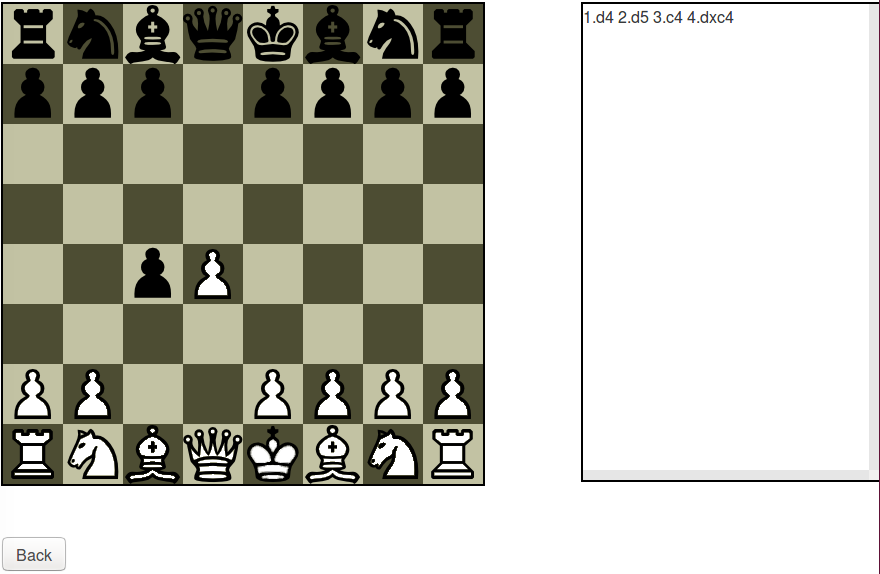

# chess-sandbox

## Running

This project is in the development stage. Fire up ring with
`lein run` to test it.

## TODO

The obvious shortcoming is that any piece may move anywhere on the board not
occupied by the same color.

Possible extensions:
1. Turn based mode
2. Save/Load PGN files

